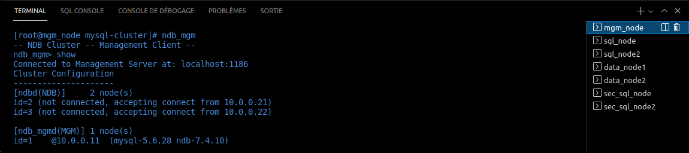
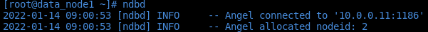
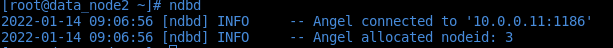
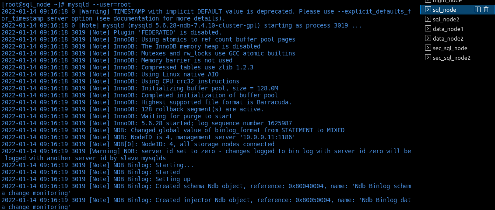
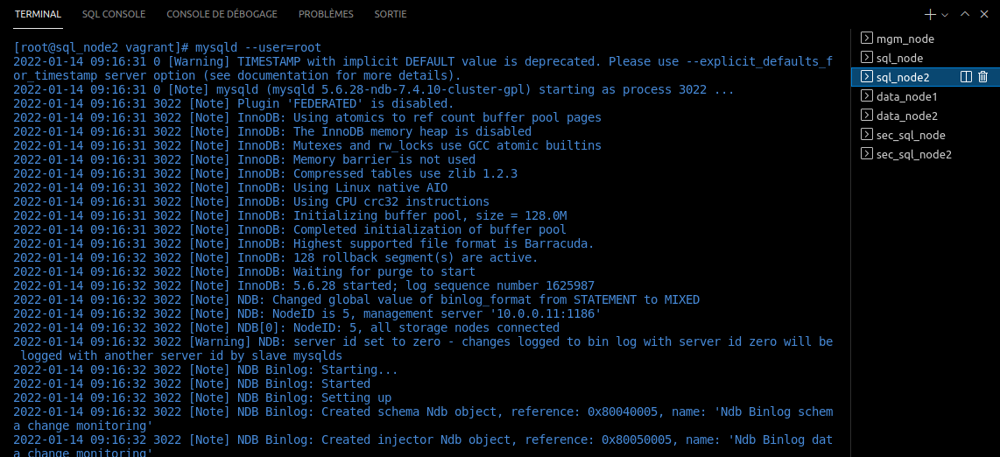
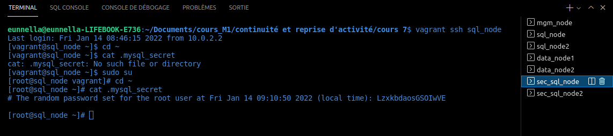
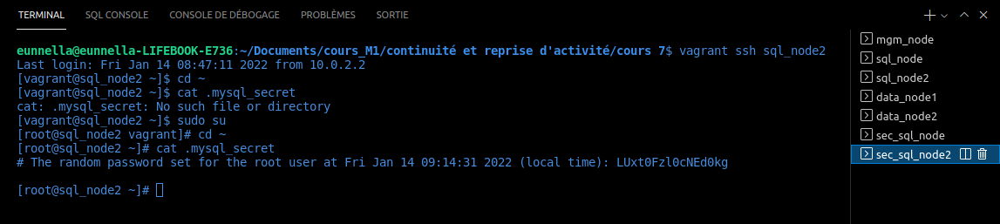
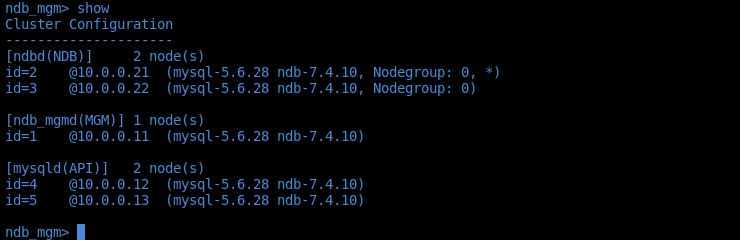
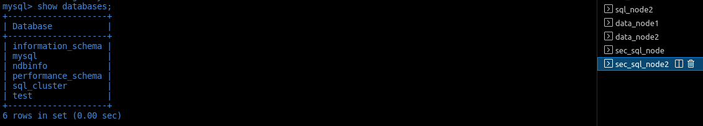
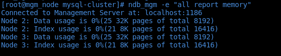

## Cluster SQL

Liste des machines :
- 2 MySQL data nodes (ndbd), qui vont faire la redondance des données.
- 1 serveur qui aura la rôle Cluster Manager (ndb_mgmd).
- 2 serveur MySQL server/client (mysqld et mysql).

| Properties | Management node         | Datanode 1              | Datanode 2              | Sql node                | Sql Node 2              |
| ---------- | ----------------------- | ----------------------- | ----------------------- | ----------------------- | ----------------------- |
| OS         | CentOS 7                | CentOS 7                | CentOS 7                | CentOS 7                | CentOS 7                |
| vCPU       | 1                       | 1                       | 1                       | 1                       | 1                       |
| Memory     | 1 GB                    | 1 GB                    | 1 GB                    | 1 GB                    | 1 GB                    |
| Disk       | 20 GB                   | 20 GB                   | 20 GB                   | 20 GB                   | 20 GB                   |
| Disk 1     | 1 GB                    | 10 GB                   | 10 GB                   |                         |                         |
| Hostname   | mgm_node                | data_node1              | data_node2              | sql_node                | sql_node                |
| FQDN       | mysql_mngmt.example.com | mysql_data1.example.com | mysql_data2.example.com | mysql_node1.example.com | mysql_node2.example.com |
| IP Address | 10.0.2.20               | 10.0.2.21               | 10.0.2.22               | 10.0.2.25               | 10.0.2.26               |

### Management Node (mgm_node)

```sh
# Installation
$ sudo su
$ cd ~
$ yum -y install wget
$ wget http://dev.mysql.com/get/Downloads/MySQL-Cluster-7.4/MySQL-Cluster-gpl-7.4.10-1.el7.x86_64.rpm-bundle.tar
$ tar -xvf MySQL-Cluster-gpl-7.4.10-1.el7.x86_64.rpm-bundle.tar
$ yum -y remove mariadb-libs
$ yum -y install perl-Data-Dumper
$ yum install -y libaio.x86_64 libaio-devel.x86_64 net-tools
$ rpm -Uvh MySQL-Cluster-client-gpl-7.4.10-1.el7.x86_64.rpm
$ rpm -Uvh MySQL-Cluster-server-gpl-7.4.10-1.el7.x86_64.rpm
$ rpm -Uvh MySQL-Cluster-shared-gpl-7.4.10-1.el7.x86_64.rpm

# Configuration
$ mkdir -p /var/lib/mysql-cluster
$ cd /var/lib/mysql-cluster
$ mkdir /data
$ yum install vim
$ vim config.ini
# Remplir le fichier
  [ndb_mgmd default]
  # Directory for MGM node log files
  DataDir=/data
  
  [ndb_mgmd]
  #Management Node db1
  HostName=10.0.0.11
  
  [ndbd default]
  NoOfReplicas=2      # Number of replicas
  DataMemory=256M     # Memory allocate for data storage
  IndexMemory=128M    # Memory allocate for index storage
  #Directory for Data Node
  DataDir=/data

  [ndbd]
  #Data Node db1
  HostName=10.0.0.21
  
  [ndbd]
  #Data Node db2
  HostName=10.0.0.22

  [mysqld]
  #MySQL Node
  HostName=10.0.0.12

  [mysqld]
  #MySQL Node2
  HostName=10.0.0.13
```

Démarrer le management node :

```sh
$ ndb_mgmd --config-file=/var/lib/mysql-cluster/config.ini
```


Configuration des nodes pour qu'ils puissent contacter le management node :

```sh
# Installation
$ sudo su
$ cd ~
$ yum -y install wget
$ wget http://dev.mysql.com/get/Downloads/MySQL-Cluster-7.4/MySQL-Cluster-gpl-7.4.10-1.el7.x86_64.rpm-bundle.tar
$ tar -xvf MySQL-Cluster-gpl-7.4.10-1.el7.x86_64.rpm-bundle.tar
$ yum -y remove mariadb-libs
$ yum -y install perl-Data-Dumper
$ yum install -y libaio.x86_64 libaio-devel.x86_64 net-tools
$ rpm -Uvh MySQL-Cluster-client-gpl-7.4.10-1.el7.x86_64.rpm
$ rpm -Uvh MySQL-Cluster-server-gpl-7.4.10-1.el7.x86_64.rpm
$ rpm -Uvh MySQL-Cluster-shared-gpl-7.4.10-1.el7.x86_64.rpm
$ yum install vim
# Configuration
$ vim /etc/my.cnf

  [mysqld]
  ndbcluster
  ndb-connectstring=10.0.0.11     # IP address of Management Node
  
  [mysql_cluster]
  ndb-connectstring=10.0.0.11     # IP address of Management Node


$ mkdir -p /var/lib/mysql-cluster
$ mkdir /data
$ ndbd
```
* Data node 1 :

* Data node 2 :


Configuration des nodes SQL pour qu'ils puissent contacter le management node :

```sh
# Installation
$ sudo su
$ cd ~
$ yum -y install wget
$ wget http://dev.mysql.com/get/Downloads/MySQL-Cluster-7.4/MySQL-Cluster-gpl-7.4.10-1.el7.x86_64.rpm-bundle.tar
$ tar -xvf MySQL-Cluster-gpl-7.4.10-1.el7.x86_64.rpm-bundle.tar
$ yum -y remove mariadb-libs
$ yum -y install perl-Data-Dumper
$ yum install -y libaio.x86_64 libaio-devel.x86_64 net-tools
$ rpm -Uvh MySQL-Cluster-client-gpl-7.4.10-1.el7.x86_64.rpm
$ rpm -Uvh MySQL-Cluster-server-gpl-7.4.10-1.el7.x86_64.rpm
$ rpm -Uvh MySQL-Cluster-shared-gpl-7.4.10-1.el7.x86_64.rpm
$ yum install vim
# Configuration
$ vim /etc/my.cnf

  [mysqld]
  ndbcluster
  #ndb-connectstring=10.0.0.11     # IP address for server management node
  default_storage_engine=ndbcluster     # Define default Storage Engine used by MySQL
  
  [mysql_cluster]
  ndb-connectstring=10.0.0.11     # IP address for server management node
```

Démarrer le service mysql sur les deux machines :
```sh
$ mysqld --user=root
```
* SQl node 1 :

* SQl node 2 :


Configuration des bases MySQL :
```sh
$ sudo su
$ cd ~
# récupérer le mot de passe généré aléatoirement pour l'utilisateur root du MySQL
$ cat .mysql_secret 

  sql_node : S13mHoePwl1wkI2b 
  sql_node2 : _EsOuFBDshDXsTcF 
```



Lancer le mysql_secure_boot sur les deux nodes SQL :

```sh
$ mysql_secure_installation #permet de sécuriser le mysql 

  You already have a root password set, so you can safely answer 'n'.

  Change the root password? [Y/n] Y
  New password:
  Re-enter new password:
  Password updated successfully!
  Reloading privilege tables..

  Change the root password? [Y/n] Y
  New password:
  Re-enter new password:
  Password updated successfully!
  Reloading privilege tables..
  ... Success!

  Remove anonymous users? [Y/n] Y 
  ... Success!

  Disallow root login remotely? [Y/n] n
  ... Success!

  Remove test database and access to it? [Y/n] Y
  - Dropping test database...
  ... Success!
  - Removing privileges on test database...
  ... Success!

  Reload privilege tables now? [Y/n] Y
  ... Success!

  All done!  If you've completed all of the above steps, your MySQL
  installation should now be secure.

  Thanks for using MySQL!
```

Connexion au mysql avec la nouveau mot de passe que l'on a défini précédemment :

```sh
$ mysql -u root -p
  mysql> select user, host, password from mysql.user;
  +------+-----------+-------------------------------------------+
  | user | host      | password                                  |
  +------+-----------+-------------------------------------------+
  | root | localhost | *44367FB67F0548551DA6A5A6732A69A340694B71 |
  | root | 127.0.0.1 | *44367FB67F0548551DA6A5A6732A69A340694B71 |
  | root | ::1       | *44367FB67F0548551DA6A5A6732A69A340694B71 |
  | root | %         | *44367FB67F0548551DA6A5A6732A69A340694B71 |
  +------+-----------+-------------------------------------------+

  #on récupère le mot de passe que l'on a dans la liste ci-dessus pour donner tous les privilèges sur le MySQL
  mysql> GRANT ALL PRIVILEGES ON *.* TO 'root'@'%' IDENTIFIED BY PASSWORD '*570C286CB1F0B445A804AEA5A0133F065D08CC35' WITH GRANT OPTION;
  Query OK, 0 rows affected (0.00 sec)
```

```sh
$ ndb_mgm
```


Création database sur le sql node 1 :


Vérification de la création automatique de la database sur le node sql 2 :


Commandes utiles :

```sh
$ ndb_mgm #permet de voir l'état du cluster
$ ndb_mgm -e "all report memory" #permet d'avoir l'utilisation sur les nodes
```


## Questions :


Quel impact aura la perte du management node ? 

Est-ce que le management node à un rôle critique dans le fonctionnement de mon cluster ? Quelle solution de secours peut-on imaginer ? 

Quel est l'impact de la perte de mon DataNode1 ?

Quel est l'impact de la perte de mon SQL node 2 ?


| Evenement | Evenement attendu | Evenement obtenu |
| --------- | ----------------- | ---------------- |
|           |                   |                  |
|           |                   |                  |

