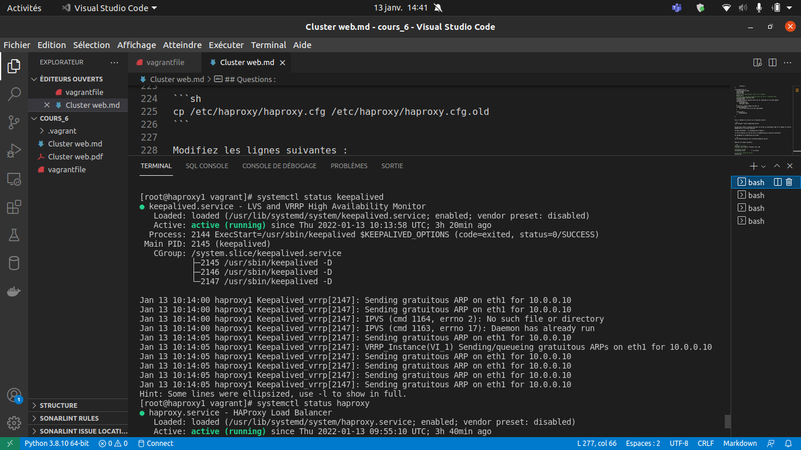
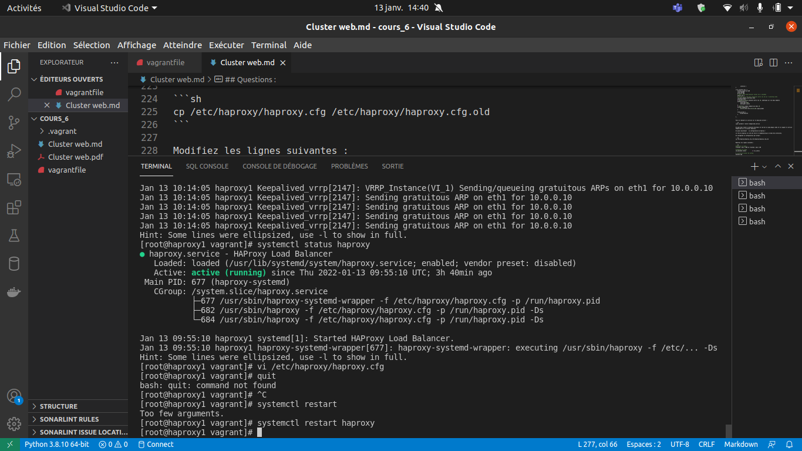
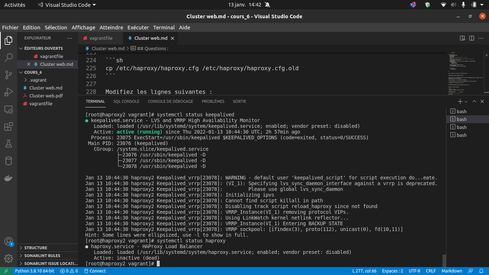
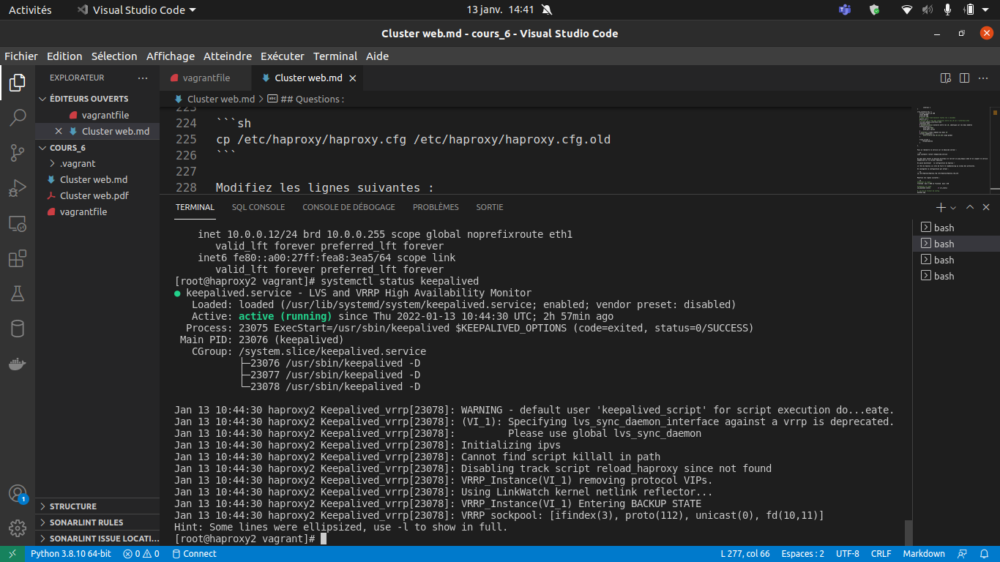
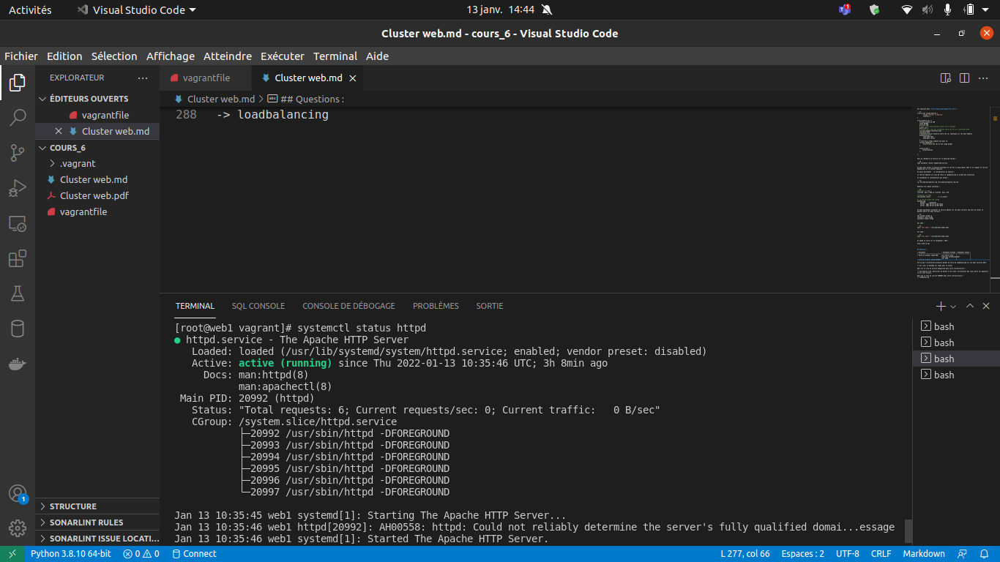
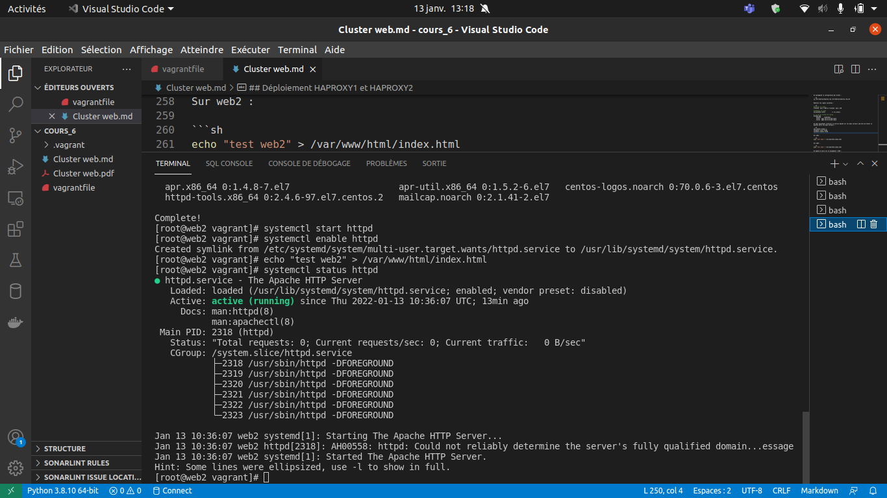
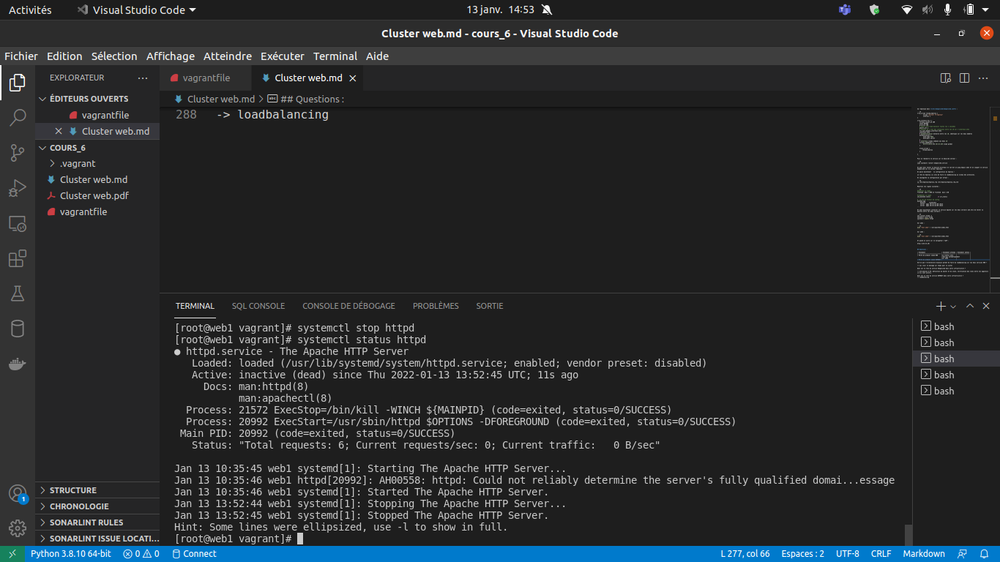
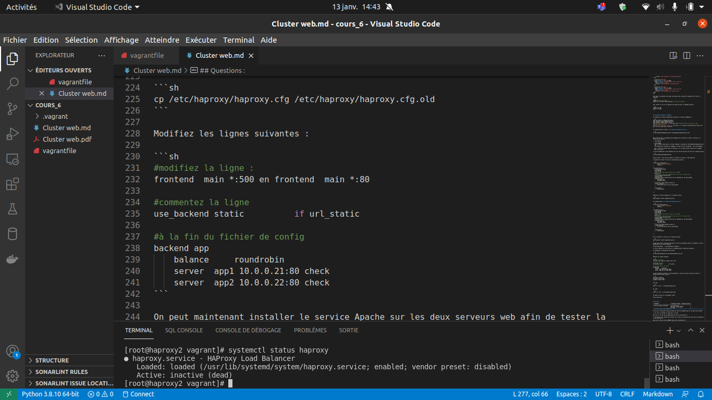

# TP-PRA-PCA

## Installation de Keepalived sur HAProxy1 et HAProxy2
Exécuter les commandes suivantes sur les deux HAProxy :
```bash
sudo yum install -y keepalived haproxy
sudo systemctl enable keepalived.service
sudo systemctl enable haproxy.service
echo "net.ipv4.ip_forward=1" >> /etc/sysctl.conf # permet de dire au kernel qu'il peut transmettre les flux IP
echo "net.ipv4.ip_nonlocal_bind=1" >> /etc/sysctl.conf # permet au load balancer de bind une IP qui n'est pas locale pour le failover
```

## HAProxy1 (Maître)
### Configurer Keepalived
Dans le fichier `/etc/keepalived/keepalived.conf`:
```bash
vrrp_script reload_haproxy {
    script "killall -0 haproxy"
        interval 1
    }

vrrp_instance VI_1 {
    virtual_router_id 100
    state MASTER
    priority 100
    # Check inter-load balancer toutes les 1 secondes
    advert_int 1
    # Synchro de l'état des connexions entre les LB sur l'interface eth1
    lvs_sync_daemon_interface eth1
    interface eth1
    # Authentification mutuelle entre les LB, identique sur les deux membres
    authentication {
        auth_type PASS
        auth_pass secret
    }
    # Interface réseau commune aux deux LB
    virtual_ipaddress {
        10.0.0.10/32 brd 10.0.0.255 scope global
    }
    track_script {
        reload_haproxy
    }
}
```
Redémarrer le service avec `sudo systemctl restart keepalived.service`.  
Puis vérifier le status avec `sudo systemctl status keepalived.service`.  


### Configurer HAProxy
Dans le fichier `/etc/haproxy/haproxy.cfg`:
```bash
#---------------------------------------------------------------------
# main frontend which proxys to the backends
#---------------------------------------------------------------------
frontend  main *:80
    acl url_static       path_beg       -i /static /images /javascript /stylesheets
    acl url_static       path_end       -i .jpg .gif .png .css .js

    #use_backend static          if url_static
    default_backend             app

#---------------------------------------------------------------------
# static backend for serving up images, stylesheets and such
#---------------------------------------------------------------------
backend static
    balance     roundrobin
    server      static 127.0.0.1:4331 check

#---------------------------------------------------------------------
# round robin balancing between the various backends
#---------------------------------------------------------------------
backend app
    balance     roundrobin
    server  app1 10.0.0.21:80 check
    server  app2 10.0.0.22:80 check
```
Redémarrer le service avec `sudo systemctl restart keepalived.service`.  
Puis vérifier le status avec `sudo systemctl status keepalived.service`.  



## HAProxy2 (Esclave)
### Configurer Keepalived
Dans le fichier `/etc/keepalived/keepalived.conf`:
```bash
vrrp_script reload_haproxy {
    script "killall -0 haproxy"
        interval 1
    }

vrrp_instance VI_1 {
    virtual_router_id 100
    state BACKUP
    priority 100
    # Check inter-load balancer toutes les 1 secondes
    advert_int 1
    # Synchro de l'état des connexions entre les LB sur l'interface eth1
    lvs_sync_daemon_interface eth1
    interface eth1
    # Authentification mutuelle entre les LB, identique sur les deux membres
    authentication {
        auth_type PASS
        auth_pass secret
    }
    # Interface réseau commune aux deux LB
    virtual_ipaddress {
        10.0.0.10/32 brd 10.0.0.255 scope global
    }
    track_script {
        reload_haproxy
    }
}
```
Redémarrer le service avec `sudo systemctl restart keepalived.service`.  
Puis vérifier le status avec `sudo systemctl status keepalived.service`.  

### Configurer HAProxy
Dans le fichier `/etc/haproxy/haproxy.cfg`:
```bash
#---------------------------------------------------------------------
# main frontend which proxys to the backends
#---------------------------------------------------------------------
frontend  main *:80
    acl url_static       path_beg       -i /static /images /javascript /stylesheets
    acl url_static       path_end       -i .jpg .gif .png .css .js

    #use_backend static          if url_static
    default_backend             app

#---------------------------------------------------------------------
# static backend for serving up images, stylesheets and such
#---------------------------------------------------------------------
backend static
    balance     roundrobin
    server      static 127.0.0.1:4331 check

#---------------------------------------------------------------------
# round robin balancing between the various backends
#---------------------------------------------------------------------
backend app
    balance     roundrobin
    server  app1 10.0.0.21:80 check
    server  app2 10.0.0.22:80 check
```
Redémarrer le service avec `sudo systemctl restart haproxy.service`.  
Puis vérifier le status avec `sudo systemctl status haproxy.service`.  


## Serveur WEB 1
Exécuter les commandes suivantes pour installer et démarrer le serveur :
```bash
yum install httpd -y
systemctl start httpd
systemctl enable httpd
```
Vérifier le status du serveur web avec `sudo systemctl status httpd`.  

Ajouter du text au fichier index.html créer lors de l'installation du serveur avec `echo "test web1" > /var/www/html/index.html`.


## Serveur WEB 2
Exécuter les commandes suivantes pour installer et démarrer le serveur :
```bash
yum install httpd -y
systemctl start httpd
systemctl enable httpd
```
Vérifier le status du serveur web avec `sudo systemctl status httpd`.  

Ajouter du text au fichier index.html créer lors de l'installation du serveur avec `echo "test web2" > /var/www/html/index.html`.

## Vérifications
### Lorsque tout fonctionne :
* HAProxy1 Actif :


* HAProxy2 Actif :


* WEB1 Actif :

* WEB2 Actif :

* Vérifications :


### Lorsque le serveur WEB1 tombe :
* WEB1 Inactif :

* WEB2 Actif :

* HAProxy1 Actif :


* HAProxy2 Actif :


* Vérifications :

### Lorsque le HAProxy2 tombe :
* HAProxy2 Inactif :

* HAProxy1 Actif :


* WEB1 Actif :

* WEB2 Actif :

* Vérifications :


## Réponses aux questions :

* q1)  Oui car nous avons configuré les deux serveur web de la même manière et les haproxy en tant que Maître/Esclave pour que l'esclave prenne le relais quand le maître tombe.

* q2) Keepalived définit les rôle des haproxy , ici, il définit le maître et l'esclave. Il fait le lien entre les deux, empêche qu'il se brise et vérifie que celui-ci est toujours actif.

* q3) Il fournit le loadbalancing, c'est à dire qu'il équilibre les charges à haute disponibilité. Il met aussi en place un serveur proxy pour les applications TCP et HTTP qui répartissent les requêtes sur plusieurs serveurs.

| Evenement                      | Evenement attendu | Evenement obtenu |
| ------------------------------ | ----------------- | ---------------- |
| Perte du premier noeud WEB     | Tout le traffic passe automatiquement par le WEB2  | Le traffic passe bien par WEB2 automatiquement |
| Perte du premier noeud HAPROXY | Tout le traffic passe automatiquement par le HAPROXY2 | Le traffic passe bien par HAProxy2 automatiquement |
